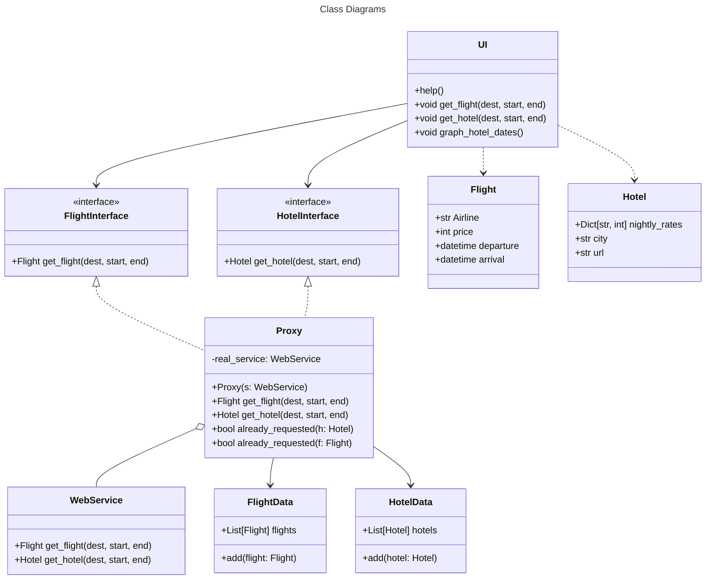

# Fine Hotels + Resorts Deal Finder

This project enables you to find the best (priced) place to spend the Amex Platinum Card $200 hotel credit by querying real-time data to create an interactive graph of prices and dates.

See an example graph here: [https://tristanwhite.me/fhr.html](https://tristanwhite.me/fhr.html)

For an explanation of the motivation behind this project, see [this post](https://tristanwhite.me/optimizing-amex-hotel-credit.html)

Aggregates FHR search results from the Amex Travel website.

# Usage
Ensure `fhrlib.py` is in the same directory as `fhr_cli.py`.
Run `python3 fhr_deal_finder --help` from above the root direcory of this project to see command line options.

```
$ python3 fhr_deal_finder --help
Usage: __main__.py [OPTIONS]

Options:
  -b, --begin [%Y-%m-%d]          The start date for data queries. Format:
                                  yyyy-mm-dd
  -e, --end [%Y-%m-%d]            The end date for data queries. Format: yyyy-
                                  mm-dd
  -o, --output TEXT               Name of the output csv file used to save the
                                  graph's source data  [default: output.csv]
  -s, --state [Alabama|Alaska|Arizona|Arkansas|California|Colorado|Connecticut|Delaware|Florida|Georgia|Hawaii|Idaho|Illinois|Indiana|Iowa|Kansas|Kentucky|Louisiana|Maine|Maryland|Massachusetts|Michigan|Minnesota|Mississippi|Missouri|Montana|Nebraska|Nevada|New Hampshire|New Jersey|New Mexico|New York|North Carolina|North Dakota|Ohio|Oklahoma|Oregon|Pennsylvania|Rhode Island|South Carolina|South Dakota|Tennessee|Texas|Utah|Vermont|Virginia|Washington|West Virginia|Wisconsin|Wyoming]
                                  State used in query. Required if city is
                                  given.
  -r, --region [United States|South America|Europe|Asia Pacific|Middle East|Middle East and Africa]
                                  Region used in query.  [required]
  -c, --city TEXT                 The city used in the query. City name needs
                                  to be capitalized. This option isn't well
                                  tested - if not working, don't use this
                                  option and use only the state of the city;
                                  you should still be able to find the hotel
                                  in the data.
  --help                          Show this message and exit.

```

# Roadmap
- Integrate a flight info web scraper
  - then correlate flight info to hotel deals to find economic trips
- switch from using (uninteractive) click library to prompt_toolkit. This will:
  - let the app be used in sessions, which will decrease time spent during initialization and shut down processes
  - allow for auto completion, making it simpler to input queries





