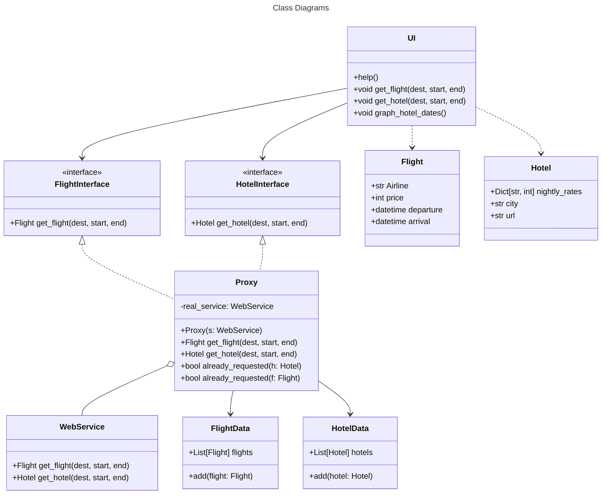

Things I wan to do from UI:
- check flight for a certain day according to
    - departure date
    - arrival date

```mermaid
---
title: Class Diagrams
---

classDiagram
    UI --> FlightInterface
    UI --> HotelInterface
    UI ..> Flight
    UI ..> Hotel
    FlightInterface <|.. Proxy
    HotelInterface <|.. Proxy
    Proxy o-- WebService
    Proxy --> FlightData
    Proxy --> HotelData


    class UI{
        +help()
        +void get_flight(dest, start, end)
        +void get_hotel(dest, start, end)
        +void graph_hotel_dates()
    }
    class FlightInterface {
        <<interface>>
        +Flight get_flight(dest, start, end)
    }
    class HotelInterface {
        <<interface>>
        +Hotel get_hotel(dest, start, end)
    }
    class Proxy{
        -real_service: WebService
        +Proxy(s: WebService)
        +Flight get_flight(dest, start, end)
        +Hotel get_hotel(dest, start, end)
        +bool already_requested(h: Hotel)
        +bool already_requested(f: Flight)
    }
    
    class WebService{
        +Flight get_flight(dest, start, end)
        +Hotel get_hotel(dest, start, end)
    }

    class Flight{
        +str Airline
        +int price
        +datetime departure
        +datetime arrival
    }

    class FlightData{
        +List[Flight] flights
        +add(flight: Flight)
    }
    class HotelData{
        +List[Hotel] hotels
        +add(hotel: Hotel)
    }

    class Hotel{
        +Dict[str, int] nightly_rates
        +str city
        +str url
    }


```
